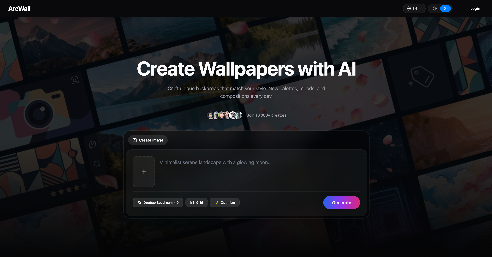

<div align="center">
  
  <h1>ArcWall</h1>
  <p><b>AI 壁纸创作与资产管理平台</b></p>
  <p>
    <a href="https://nextjs.org/"></a>
    <a href="https://www.prisma.io/"></a>
    <a href="https://redis.io/"></a>
    <a href="https://www.rabbitmq.com/"></a>
    <a href="../LICENSE"></a>
  </p>
  <p>
    <a href="../README.md">English</a> | 简体中文
  </p>
</div>

---

## 📖 简介

ArcWall 是一个面向创作者的 AI 壁纸平台：你输入提示词，它负责把灵感变成高清壁纸。项目包含完整的生成、发布、收藏、回收站、积分与账单体系，以及异步任务处理链路。简单说，它像一个“会画画、会排队、还会记账”的数字工作台。

## 🌟 预览图

> 预览资源来自 `public/` 目录。



<div align="center">
  <table>
    <tr>
      <td align="center"><b>Poster 01</b></td>
      <td align="center"><b>Poster 02</b></td>
    </tr>
    <tr>
      <td></td>
      <td></td>
    </tr>
    <tr>
      <td align="center"><b>Poster 03</b></td>
      <td align="center"><b>Poster 04</b></td>
    </tr>
    <tr>
      <td></td>
      <td></td>
    </tr>
  </table>
</div>

## ✨ 功能特性

- 🎨 **AI 生成与提示词优化**：支持提示词输入、模型参数传递、异步生成与失败重试。
- 🖼️ **画廊与作品管理**：支持热门/最新画廊、我的创作、发布/取消发布、收藏、批量操作。
- 🗑️ **回收站机制**：删除作品后可恢复或永久清理，减少“手滑删库式”创作事故。
- 💰 **积分与账单系统**：支持积分消耗/充值记录、订单与余额流水。
- 🌐 **国际化**：内置中英文文案（`messages/zh.json`、`messages/en.json`）。
- ⚡ **异步任务架构**：RabbitMQ + Redis + Worker 处理生成任务，支持分布式锁、进度缓存、结果缓存。
- ☁️ **对象存储上传**：支持上传文件到 OSS，并返回签名访问链接。

## 🛠️ 技术栈

- **Frontend**: Next.js 14, React 18, Tailwind CSS, Radix UI
- **State/Data**: Zustand, TanStack Query
- **Auth**: Clerk
- **Database**: PostgreSQL + Prisma
- **Queue & Cache**: RabbitMQ, Redis
- **AI Service**: OpenAI SDK-compatible endpoint (`ARK_API_BASE_URL`)
- **Storage**: Aliyun OSS
- **Deployment**: Vercel（含 Cron + function maxDuration 设置）

## 📁 项目结构

```text
arcwall/
├── app/                 # Next.js App Router 页面与 API 路由
├── components/          # UI 组件库
├── lib/                 # 基础设施工具类 (prisma/redis/rabbitmq/oss/auth)
├── messages/            # i18n 多语言文件
├── models/              # 数据访问层
├── prisma/              # 数据库 Schema 与种子数据
├── services/            # 外部服务封装
├── store/               # Zustand 状态管理
├── workers/             # 后台 Worker 进程
└── public/              # 静态资源
```

## 🚀 项目启动

### 1. 安装依赖

```bash
npm install
```

### 2. 配置环境变量

在项目根目录创建 `.env` 文件（按实际环境填写）。

```env
# Clerk
NEXT_PUBLIC_CLERK_PUBLISHABLE_KEY=
CLERK_SECRET_KEY=
NEXT_PUBLIC_CLERK_SIGN_IN_URL="/sign-in"
NEXT_PUBLIC_CLERK_SIGN_UP_URL="/sign-up"
NEXT_PUBLIC_CLERK_AFTER_SIGN_IN_URL="/"
NEXT_PUBLIC_CLERK_AFTER_SIGN_UP_URL="/"

# Your app url
NEXT_PUBLIC_APP_URL=

# Database
DATABASE_URL=
DIRECT_URL=

# Redis
REDIS_URL=

# RabbitMQ
RABBITMQ_URL=

# OSS
OSS_REGION=
OSS_AK=
OSS_SK=
OSS_BUCKET=
OSS_HOST=

# AI service (OpenAI-compatible)
ARK_API_BASE_URL=
ARK_API_KEY=

# App / Security
CRON_SECRET=
```

### 3. 生成 Prisma Client & 推送数据库结构

```bash
# 生成 Prisma Client
npm run prisma:generate

# 推送结构到数据库
npm run db:push

# 或者你更喜欢迁移流程：
npm run prisma:migrate
```

### 4. 启动开发服务

```bash
npm run dev
```

默认访问地址：`http://localhost:3000`

### 5. 启动 Worker（建议另开终端）

```bash
npm run worker
```

> **注意：** 没有 Worker 时，任务队列不会被处理。

## ☁️ 部署

### Vercel（推荐）

本项目已包含 `vercel.json`：
- 指定构建命令：`prisma generate && next build`
- 为关键 API 设置了 `maxDuration`
- 配置了 `/api/worker/process-queue` 的定时 Cron（每分钟）

**步骤：**
1. 在 Vercel 导入仓库
2. 配置全部环境变量
3. 执行部署
4. 确保数据库、Redis、RabbitMQ、OSS 均可从部署环境访问

> **注意：** 定时任务使用 `CRON_SECRET` 做鉴权，请与请求端保持一致。

## 📜 常用脚本

| 命令 | 说明 |
|---|---|
| `npm run dev` | 启动开发服务 |
| `npm run build` | 生产环境构建 |
| `npm run start` | 启动生产服务 |
| `npm run lint` | 运行代码检查 |
| `npm run prisma:generate` | 生成 Prisma Client |
| `npm run db:push` | 推送 Schema 到数据库 |
| `npm run prisma:migrate` | 运行数据库迁移 |
| `npm run worker` | 启动后台 Worker 进程 |

## 🔌 API 概览（部分）

- `POST /api/get-wallpapers`：获取壁纸列表（latest/trending）
- `POST /api/upload`：上传文件并返回签名 URL
- `POST /api/dictionaries`：获取字典配置
- `POST /api/get-user-info`：获取用户信息
- `POST /api/models`：获取模型配置

## 📊 数据模型（节选）

核心实体包含：
- `users`, `roles`, `user_roles`
- `wallpapers`, `system_wallpapers`, `favorites`
- `orders`, `user_balance`, `credit_transactions`
- `dictionaries`, `redeem_codes`, `prompt_optimizations`

完整定义见：`prisma/schema.prisma`

## 💡 补充说明

### 🔒 安全建议
- 不要把 `.env` 提交到代码仓库。
- 生产环境请使用独立的密钥与最小权限策略。
- 对外接口建议补充限流与审计日志。

### ⚡ 性能建议
- 图片处理链路可增加 CDN 缓存策略。
- Worker 可按队列长度进行水平扩容。
- Prisma 查询建议结合索引和分页策略。

### 🐛 故障排查
- **页面可开但生成不动**：先检查 Redis/RabbitMQ/Worker 是否在线。
- **生成失败**：检查 AI 服务密钥、网络连通和配额。
- **图片访问失败**：检查 OSS 权限、签名时效和域名配置。

## 📄 License

本项目基于 [MIT](../LICENSE) 协议开源。

## 🙏 致谢

感谢所有把“我有个想法”变成“哇这壁纸真香”的开发者与创作者。
